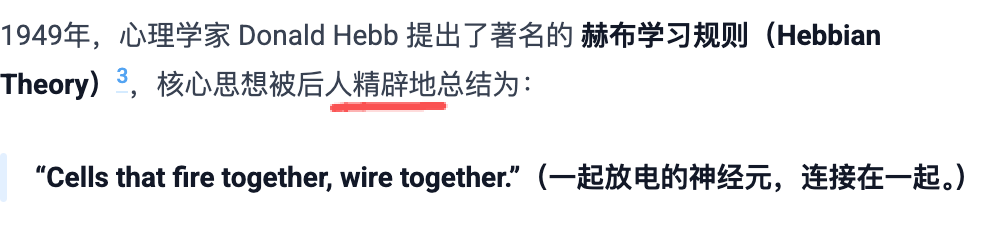

## 1
以前的程序无非是 输入 → 输出，逻辑是僵硬的；但当我们在“输入”和“输出”之间加上一层“智能”，一切似乎就有了无限可能。

这句话不对
严格来说不算完全不对
从我审稿的角度来说，这句话就是事实性错误
中间没有加一层
这句话要我说，就是把中加加上一层智能这个描述，放到前面
以前的程序无非是输入-输出，中间的逻辑被人预先写死的，十分僵硬；当我们把输入和输出之间的规则，替换成经过训练的模型后，便可能涌现出过去难以企及的可能性
这句话原先要表达的就是“涌现”逻辑

## 2
这句我都不用查，肯定是事实性错误
还标粗了
肯定不是第一次
我不知道第一次是啥，在之前光我知道就有图灵和香农
这句话删掉
一看就是ai修辞
逻辑电路是个什么玩意儿

## 3
可以写成“因为人类有很多隐性知识无法手工编写成规则让机器完成。我们知道的比我们能说出的多”
为什么需要一个“可学习”的模型？因为人类有很多隐性知识无法手工编写成规则让机器完成。我们知道的比我们能说出的多。所以，与其编程，不如让机器自己从数据中摸索规律。
我还真没想过隐性知识的问题，这段话不错
措辞可以改一下
还有个典型的ai写作问题啊，后面我就不全指出来了，就说这一次

## 4

这等于是帮读者预设了判断
读者未必觉得这个总结精辟
这是典型的ai表述
这种都可以删掉
完全不影响阅读
还显得冷静简洁

## 5

应该是能够完成大规模视觉识别任务
感知机当年处理的我记得是字母识别
这完全两回事啊 
但确实是“图像识别”的目的
但用图像识别不行
能够完成简单的视觉识别任务好一些

## 6
"感知机的失败其实是一个典型的”期望错配”一一媒体和投资人把一项原始技术当成了终极解决方案。"

这个“原始技术”，是咱们现在的人看
但是在这个语境里，这不是原始技术

## 7!

从加速度之章开始，前面说那个替读者预判的问题太多了
什么“震撼”
近乎无限
这种修辞性夸张太多了
观感上前后脱节了
前面是挺严谨的语气，从加速度之章开始，图穷匕见，变成了“ai吹”

## 8!

而且脱离前文去看
光这一章内部读起来也不得劲儿
前一句吹，后一句又回归冷静科普语气
就有点怪
我先接着往下看
什么“几乎看不到天花板”
我今天还写这个事呢
批判这个事

## 9
这句我就是跟你吐槽一下
这可太有西方那种论调了
怎么的，刚过去3天，就历史铭记了？
2026年9月3日，必定会被历史铭记
这都强一些
在看未来之章之前啊
我说一下整体观感
第一部分就是科技史的叙事，问题很少
但是第二部分完全变成了预测叙事

## 整体观感

第一部分就是科技史的叙事，问题很少
但是第二部分完全变成了预测叙事
这样就导致了这篇文章有断裂感
如果读者情绪能跟着作者走还行
但事实上，以我写网文的感受来讲，没有铺垫，读者情绪不可能跟着作者走
如果这是一篇公众号文章，加速度之章那里大概率被弃文
当然了，这是我写文章的逻辑，这个问题你儿自己也很难改过来

## 10
但是“chen等人”这个表述，你应该也能感觉出不对劲儿

## 11
我刚才琢磨了一下你怎么跟你儿说，“那篇文章的逻辑有问题”，你这么说他没法理解
你这么说
前面你文章的走向，给读者感觉你要写一个“我认为ai很厉害，所以我认为ai是个工业革命级别的东西，会给人类带来超级大的正面影响”

结果由于后半部分你作为作者都不懂，选错了材料（论文），导致读者的观感变成了“我认为ai很厉害，但是ai有很大问题，所以我认为ai是个非常厉害的东西，因此ai可能给人带来很多负面影响”
对，差不多就是这样
你可以教他写文章像数学几何论证那样去梳理逻辑
就是因为三角形内角和180度，a角70度，b角70度，所以c角40度
他现在要写文章，最好每一步都不要省略，哪怕是显而易见的废话
都得写出来
这样思路才能清晰
主要是他不知道写作得分析读者画像，不知道读者知道什么不知道什么，就会导致很多省略逻辑，然后省略了逻辑吧，又会导致他自己的逻辑错误
因为我个人用ai感觉很震撼，并且这几年我使用ai的过程中，这种震撼一直存在，且一次比一次强，所以，我认为，ai是个工业革命级别的东西，会彻底改变人类
这才是他这篇文章该有的逻辑结构
如果要延续下去，写ai的问题，可以往后推
后面是——但是我也知道，现在ai还存在很多问题。罗列问题后…我相信，未来在ai的辅助下，人类的智能会不断提高，这些问题都将不再是问题，让我们一起期待那一天到来吧
大概是这样
实际上他不需要去写科技史的部分…只需要写出他个人最真实的感受，然后把他能懂的那些ai目前存在的问题列清楚，最后回归他对人机合作的信心就可以了
这一章我重看了一遍
这个论点就是错的
过去七十年，每一次ai的“坎坷”，在当时的人看来，都是震撼的
他没有经历
无法想象咱们看到阿尔法狗战胜李世石新闻时候的震撼
这一章是全文逻辑断裂的起始点，ai从这里开始往后，逻辑就脱离你儿的控制了
我说一个事，你自己斟酌看适不适合跟他说
如果是我当面跟他讲，我会直接用这篇文章去批评他：你声称跟ai合作了这篇文章，只是看似合作而已，实际上ai已经完全脱离了你的控制，这是因为你现在的判断力太差了，导致你一直沉浸在ai幻觉中。这篇文章本身，足以说明你使用ai的日常状态，我现在严重怀疑你在写文章之外的情境里，也无法控制ai，一直是ai在控制你
ai是秘书不假，这个秘书能帮你做很多事也不假，但是秘书是能骗人的，秘书可能把你哄得高高兴兴的，然后用你看不懂的东西忽悠你，一个合格的老板，一定是了解公司每一层业务细节的，不然一定会下面人忽悠，ai现在就是忽悠你的那个“下面人”（名义上的下面人，其实现在ai是老板，你反而变成了那个帮它宣传的下面人）
你肯定不能说这么重，这个话适合他信服的人跟他说，就是这个意思，你琢磨琢磨怎么跟他说吧
还有一个，一定警惕他用ai写文章这件事，写文章的能力从古至今到未来，都是最重要的能力之一，用ai写文章我很确定会导致思维问题，这两天我找找新研究有没有讲这方面的，有的话写一篇
你可以拿咱们小时候抄作文的经历去举例，咱们小时候抄作文，都是懂了这篇讲啥才抄
也可以讲，所有的作家都是从“模仿”其他人文章开始学习写作的，注意，是模仿前辈的文章，模仿学习的逻辑是先看懂了对方做了什么，然后自己跟着做
而他现在不懂ai做了什么，就声称“合作”，这是个很危险的叙事
他现在应该是跟ai“学习”才对
问题我应该是都点出来了，这很不好解决，老母亲你自己想办法去吧
我换了个你大儿角度审视刚才点出的这些问题啊
我预设了前提“我们必须了解ai做了什么，再去使用ai”
也可能未来ai幻觉不存在了，人不需要了解ai做了什么，直接按照ai的指示做就行
不可能，那人就成了机器人总动员里那些大胖子了
我坚持认为，现在生成式ai是个泡沫，民用的未来完全看不到希望，底层逻辑上就有无法解决的问题
这是我跟你大儿观念不一致的关键，他就认为ai不是泡沫
你看看怎么沟通吧
我跟你说个数据，资本2025年到今年6月，光这一年半，就烧了30万亿以上在ai上了
还是美元，这还只是生成式ai啊
烧的钱主要在芯片、电力、买地三个方面
然后以资本的尿性，他们当然要一直吹，因为金融市场里，ai直接相关的杠杆，已经达到了12万亿美元的规模
间接相关的杠杆，已经达到了23万亿美元规模
他们不吹能行么
对30万亿可能没概念啊
我给你举个例子，虚拟货币比特币，最高市值才2.4万亿美元
短短两年时间，搞出30多万亿的杠杆，什么概念，这后面是层层抵押、借贷、对赌的资金链，还有每年必须偿付的巨额利息
你大儿那篇文章里自己也说了
ai技术的提升是个非常缓慢，挣扎式的向上攀登
一旦金融市场那边资金链断了，后果可想而知
我倒希望这波可千万别是泡沫，不然后果无法想象，08年次贷危机全风险承诺才10万亿
 我刚算了一下，ai全风险承诺已经至少20万亿了，具体数字翻个番也有可能